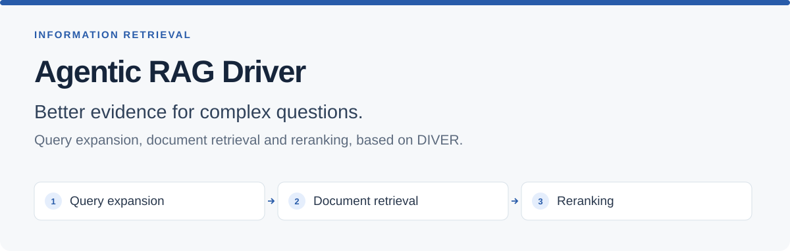
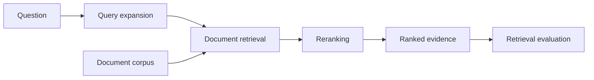
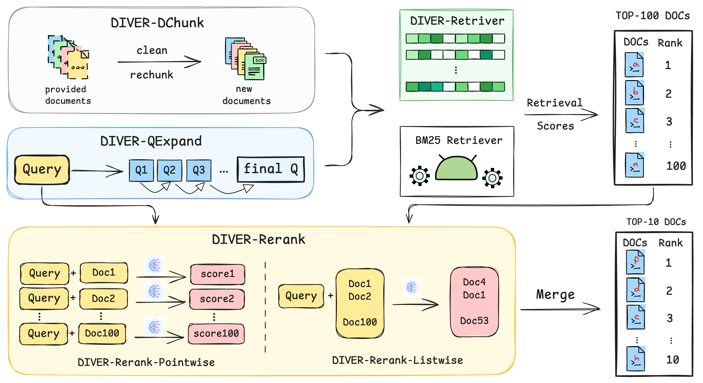

<div align="center">



# Agentic RAG Driver

**Reasoning-aware document retrieval for questions that go beyond keyword matching.**

[Workflow](#how-it-works) · [Explore the code](#explore-the-code) · [Getting started](#getting-started) · [Research reference](#research-and-attribution)

Python · Query expansion · Embedding retrieval · Reranking · BRIGHT evaluation

</div>

## Overview

Agentic RAG Driver brings together the retrieval stages of [DIVER](https://github.com/AQ-MedAI/Diver): refine a complex question, retrieve candidate documents and rerank the evidence. It provides Python research scripts, model inference examples and evaluation utilities for exploring retrieval quality.

The output is **ranked documents and retrieval scores**. These can support a knowledge assistant or research workflow when integrated with an application and an answer-generation layer.

| The problem | The approach | The output |
| --- | --- | --- |
| Relevant evidence may use different language from the question. | Expand queries using an LLM and retrieved passages. | Refined queries for document search. |
| An initial search returns candidates with mixed relevance. | Retrieve and compare documents, then apply reranking. | A more focused ranked list of evidence. |
| Retrieval changes need measurable comparison. | Evaluate on BRIGHT tasks with shared scoring utilities. | Retrieval metrics and saved experiment outputs. |

## How it works



1. **Expand the question.** Iterative LLM prompts use candidate passages to refine the search query.
2. **Find candidates.** DIVER embedding retrieval and BM25 experiments provide candidate documents.
3. **Order the evidence.** Pointwise, listwise and groupwise reranking approaches score relevance.
4. **Evaluate the results.** BRIGHT tasks and shared metrics make experiment outputs comparable.

<details>
<summary><strong>View the original DIVER research architecture</strong></summary>



Source: [DIVER paper](https://arxiv.org/abs/2508.07995).

</details>

## Explore the code

| Component | Start here |
| --- | --- |
| Query expansion and passage filtering | [`QExpand/`](QExpand/) |
| Embedding retrieval and BM25 experiments | [`Retriever/`](Retriever/) |
| Pointwise, listwise and groupwise reranking | [`Reranker/`](Reranker/) |
| Scoring and evaluation helpers | [`utils/`](utils/) |
| Reference dependency setup | [`env_requirements/README.md`](env_requirements/README.md) |
| Included example experiment files | [`QExpand/output/diver-qexpand/biology/`](QExpand/output/diver-qexpand/biology/) |

## Getting started

```bash
git clone https://github.com/nwk0112-collab/Agentic-Rag-Driver.git
cd Agentic-Rag-Driver
```

The full research pipeline uses local language models and CUDA-oriented dependencies, including vLLM and FlashAttention. GPU capacity, model paths and dataset locations need to be configured for the selected experiment.

1. Review the [environment guide](env_requirements/README.md).
2. Download the [BRIGHT dataset](https://huggingface.co/datasets/xlangai/BRIGHT) and place its `examples/` and `documents/` files under the existing `data/BRIGHT/` directory.
3. Obtain the required [DIVER model weights](https://huggingface.co/AQ-MedAI/Diver-Retriever-4B) and generation/reranking models. Update their local paths in the component scripts.
4. Align the tasks and output locations between query expansion, retrieval and reranking before running each stage.

**Execution status:** the inherited launcher scripts need adjustments before a complete run. This repository is not presented as a verified one-command application or a hosted chat demo.

<details>
<summary><strong>Configuration notes and known launcher inconsistencies</strong></summary>

- The dependency list contains `python==3.10.15`; treat this as an interpreter-version reference, not a pip package.
- `QExpand/run_qexpand.sh` contains a trailing dot on the retriever model path and inconsistent `model/` versus `models/` paths.
- `QExpand/qexpand_main.py` calls `calculate_retrieval_metrics` without importing or defining it. A shared implementation is available in `utils/eval_util.py`.
- Query expansion selects `biology` by default, while later launchers select all 12 tasks. Match the task lists and expansion-output locations.
- `Retriever/merge_scores.py` combines pointwise and listwise scores; it is not a replacement for the inherited `merge_score.py` BM25/dense-fusion command.
- The pointwise reranker accepts `--model_path`, while its launcher passes `--llm_model`. The groupwise example should reference the existing `rerank_groupwise.py` filename.
- `run_all.sh` retains inherited directory and command assumptions. Review stage handoffs before using it.

These notes come from source inspection. A full model run and independent reproduction of the published benchmark results have not been verified for this documentation refresh.

</details>

## Research and attribution

This repository is based on **DIVER**, developed by Meixiu Long, Duolin Sun, Dan Yang, Junjie Wang, Yue Shen, Jian Wang, Peng Wei, Jinjie Gu and Jiahai Wang. The models, research methods and published benchmark results are credited to the original authors.

- [Original DIVER repository](https://github.com/AQ-MedAI/Diver)
- [DIVER paper](https://arxiv.org/abs/2508.07995) · [GroupRank paper](https://arxiv.org/abs/2511.11653)
- [Detailed research documentation, examples and citation](DIVER_REFERENCE.md)
- [Original Chinese documentation](README_CN.md)
- [Apache 2.0 licence](LICENSE.txt)

The detailed research reference preserves the upstream releases, model tables, evaluation results and acknowledgements. Published results are reference material, not a claim of independently reproduced performance in this repository.
